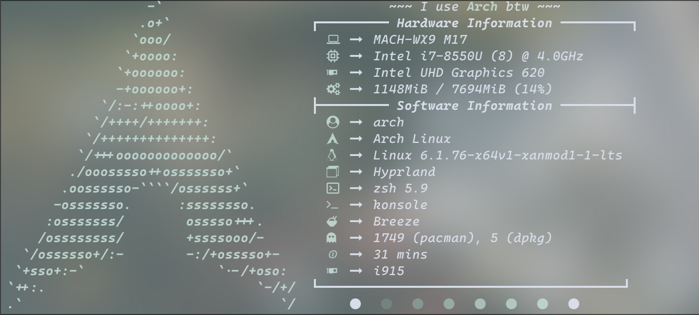
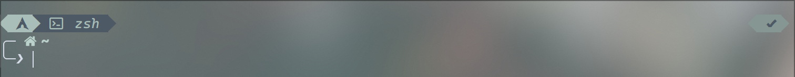
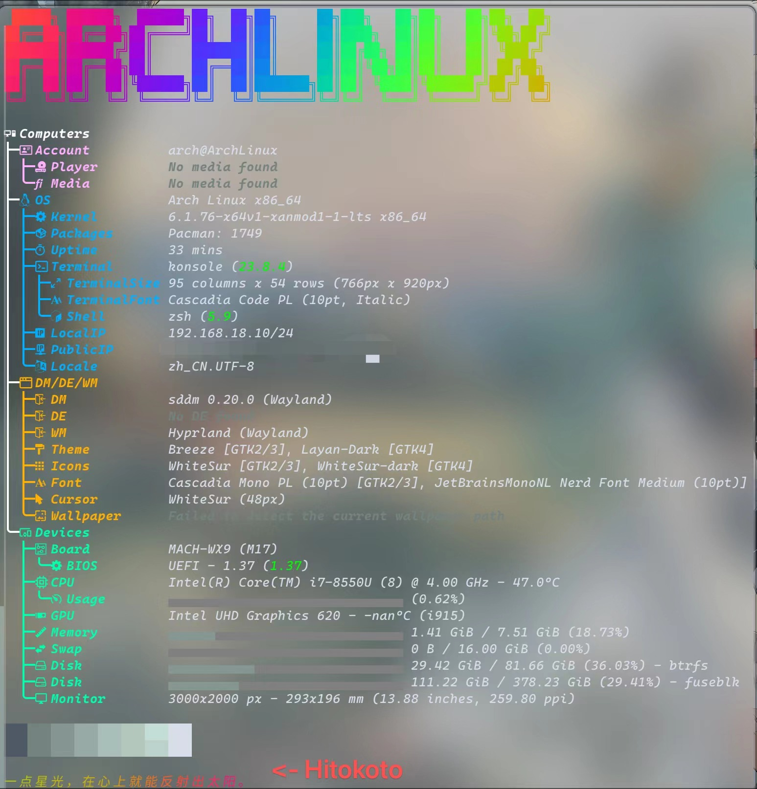

# Republic Of Lunar's dotfiles
### 适用群体
    本配置文件是为Hidpi(2x)人群适配的，不适配非Hidpi屏幕。
    如果需要使用，请自行修改，谢谢。
### 如何使用
    fastfetch  -|
    hypr       -|--- ~/.config
    neofetch   -|
    waybar     -|

    pacman
        sudo cp -r mirrorlist /etc/pacman.d
        sudo cp -r pacman.conf /etc/pacman.conf
    
    zsh -> ~
    
    wallpapers:
        swww img GreenHairGirl.png
### 演示
hypr/wallpaper
 
waybar
 
neofetch
 
powerlevel10k
 
fastfetch(Archlinux和一言Hitokoto会逐个打印)
 

### 更新时间
    V1
    2024/2/5 16:10(UTC+8)